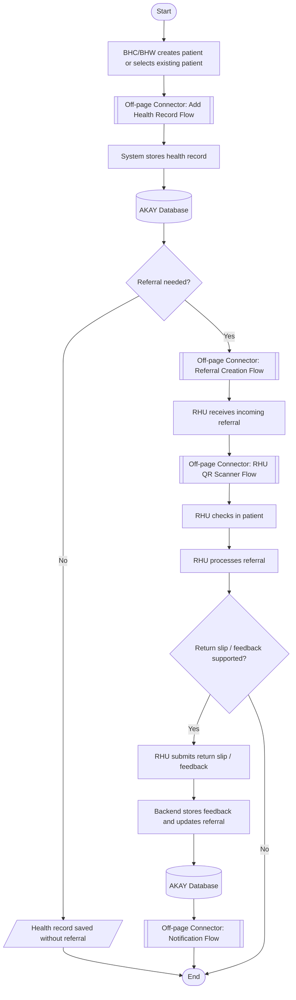
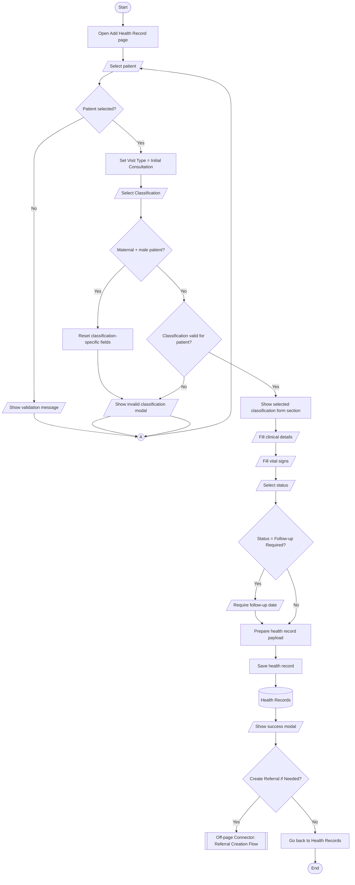
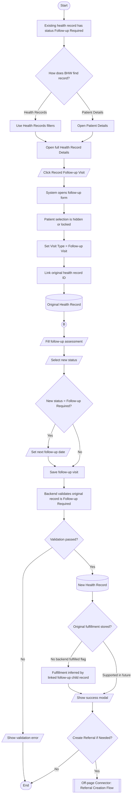
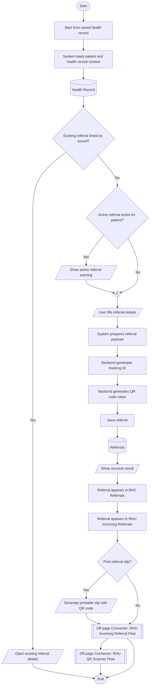
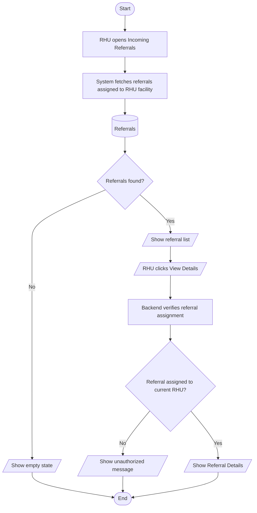
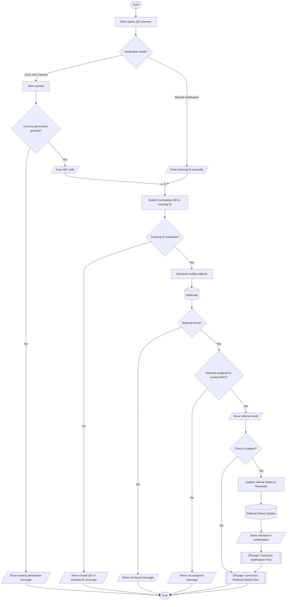
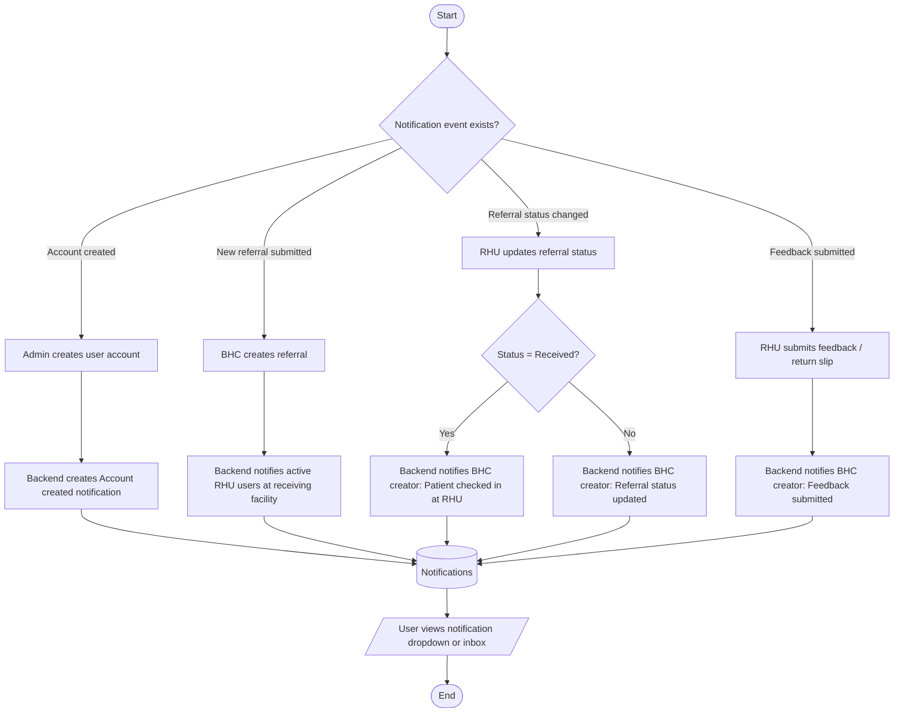
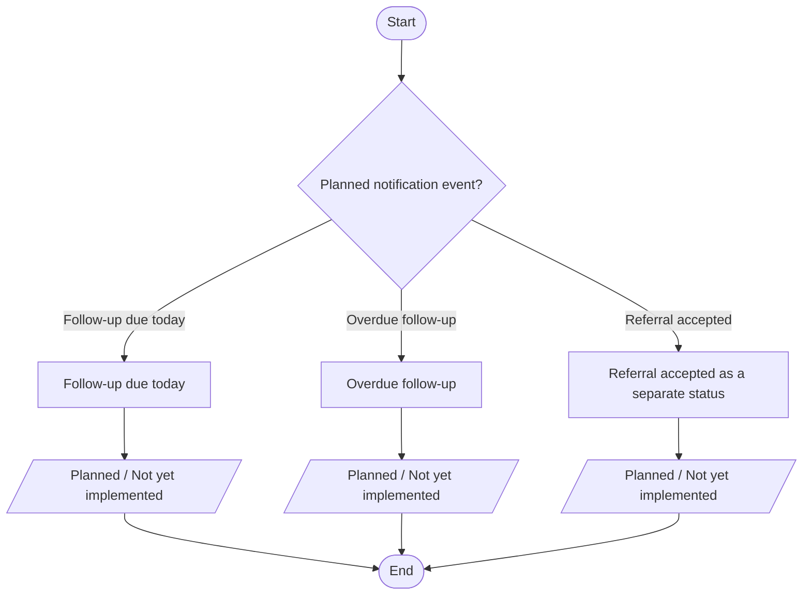
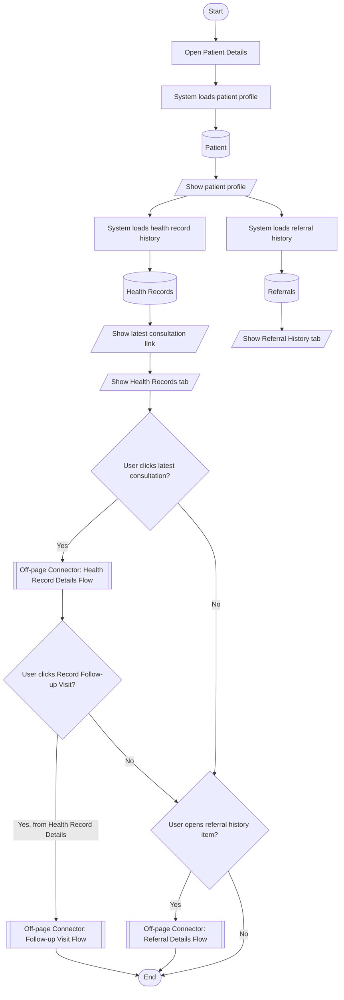

# AKAY Standard Flowcharts

This document describes the implemented AKAY workflows using standard flowchart conventions in Mermaid syntax. It is intended for capstone documentation and defense. This file is documentation only.

## 1. Overall AKAY System Flow

This flow shows the full BHC-to-RHU coordination path. Detailed steps are delegated to module-level flowcharts through off-page connectors.

Connector notes:
- Off-page connector to Add Health Record Flow: details the health record form.
- Off-page connector to Referral Creation Flow: details referral submission and QR generation.
- Off-page connector to RHU QR Scanner Flow: details QR/manual verification and check-in.
- Off-page connector to Notification Flow: details implemented notifications.

## 2. Add Health Record Flow

This flow uses the BHC health record form. New records default to Initial Consultation. Classification determines which form section appears, while status determines monitoring or closure.

Connector notes:
- On-page connector A returns the user to patient or classification selection after a validation issue.
- Off-page connector to Referral Creation Flow is available after saving a new non-Completed BHC health record.
- Maternal + male patient invalid classification modal is implemented.
- Immunization + adult confirmation modal was not found in the current code.

## 3. Follow-up Visit Flow

This flow starts from an existing health record whose status is Follow-up Required. The follow-up visit is stored as a new health record linked to the original record.

Connector notes:
- On-page connector B keeps the long setup readable before the assessment section.
- Off-page connector to Referral Creation Flow is optional after the follow-up is saved if the record is allowed to create a referral.
- The current backend stores the new linked health record, but it does not store a separate fulfilled flag on the original record.

## 4. Referral Creation Flow

This flow starts after a health record is saved. The referral is stored separately from health record status and receives its own tracking ID and QR value.

Connector notes:
- On-page connector C merges normal referral creation and the active-referral warning path.
- Off-page connector to RHU Incoming Referral Flow shows the RHU queue path.
- Off-page connector to RHU QR Scanner Flow shows printed-slip verification.

## 5. RHU Incoming Referral Flow

This flow shows how RHU staff access only referrals assigned to their RHU facility.

Connector notes:
- Database symbol represents stored referrals returned through backend facility scoping.
- Decision symbols separate empty queue and unauthorized access states.

## 6. RHU QR Scanner Verification Flow

This flow covers camera scanning and manual verification. The frontend normalizes the scanned or entered value, and the backend verifies both existence and facility assignment.

Connector notes:
- On-page connector D joins camera and manual verification into one verification path.
- Off-page connector to Referral Details Flow continues to the detailed referral page.
- Off-page connector to Notification Flow represents the BHC notification after Received status.

## 7. Notification Flow

Implemented notifications are created in the backend `notifications` table and shown through the frontend notification dropdown or inbox. Planned items are separated clearly.

### Implemented Notifications

### Planned / Not Yet Implemented Notifications

Connector notes:
- Implemented notifications use the database symbol for stored notification records.
- New incoming referral and return slip submitted notifications are implemented in the current backend.
- Follow-up due, overdue follow-up, and separate referral accepted notifications were not found as implemented backend notifications.

## 8. Patient Details Flow

This flow shows how a BHC user reviews patient information, opens health records, and reaches follow-up recording through the full Health Record Details page.

Connector notes:
- Off-page connector to Health Record Details Flow is used because Patient Details links to the full record.
- Off-page connector to Follow-up Visit Flow is reached after opening a Follow-up Required health record.
- Off-page connector to Referral Details Flow is used for referral history items.

## Flowchart Connector Legend

- On-page connector A, B, C, D = continuation within the same flowchart.
- Off-page connector = continuation to another flowchart, module, or page.
- Decision = Yes/No condition or branching condition.
- Database = stored system data.
- Terminator = Start or End.
- Process = user or system action.
- Input/Output = user input, validation message, modal, or displayed result.

## Key AKAY Workflow Rules

- Every visit/check-up creates one health record.
- Follow-up Visit is a new health record linked to the original Follow-up Required record.
- Visit Type is separate from Classification.
- Classification determines which form section appears.
- Status determines the outcome/action.
- Routine Monitoring means stable but still observed.
- Completed means closed.
- Referral is separate from health record status.
- QR code should only contain tracking ID/token, not full patient data.
- RHU can view patient data only through referrals assigned to its facility.

## Unclear Workflows Found In Code

- The original Follow-up Required record is not updated with a stored fulfilled flag. Fulfillment is inferred when a linked follow-up child record exists.
- Immunization + adult confirmation modal was requested in the prompt but was not found in the current Add Health Record code.
- Follow-up due today and overdue follow-up notifications are supported as list filters, but persistent backend notifications were not found.
- A separate "Referral accepted" notification/status was not found. The implemented statuses are Pending, Received, For Monitoring, No-Show, and Completed.
- QR scanner check-in stores a referral status update to Received. A separate check-in timestamp field was not found, but the status update/history record has timestamps.

