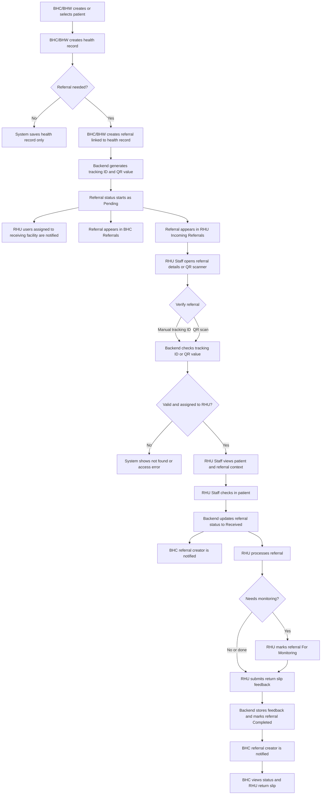
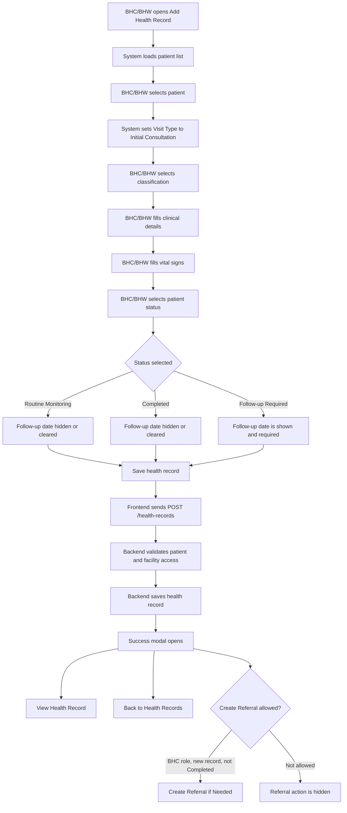
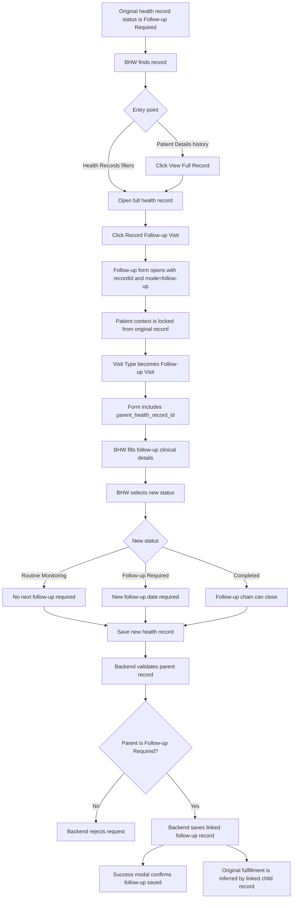
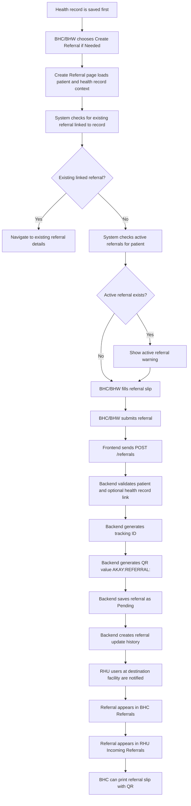
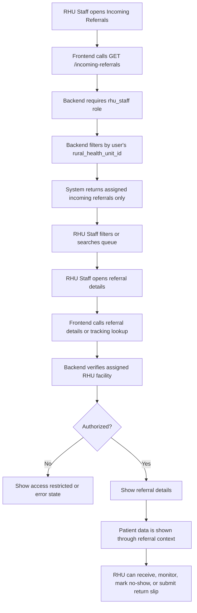
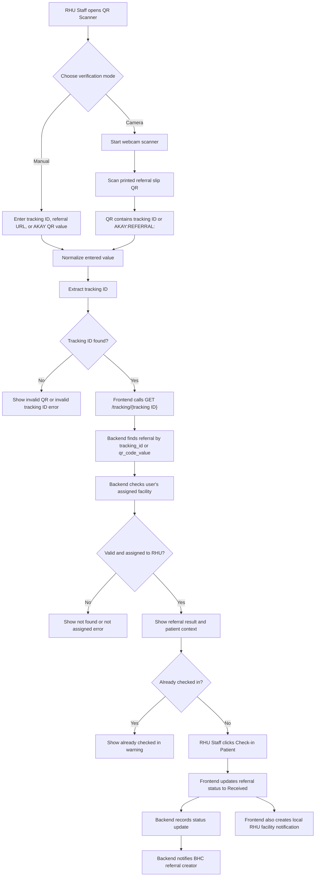
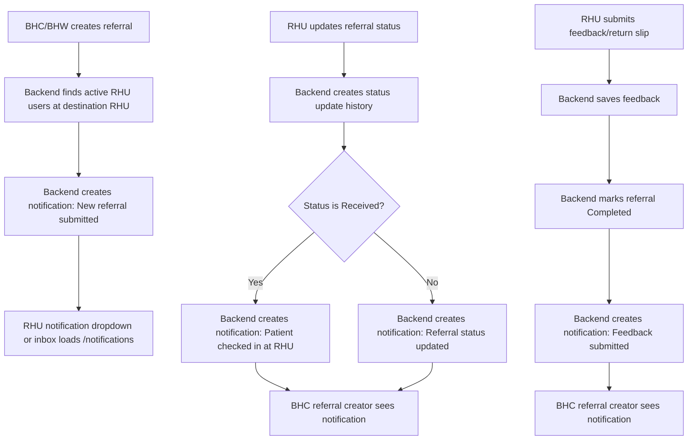
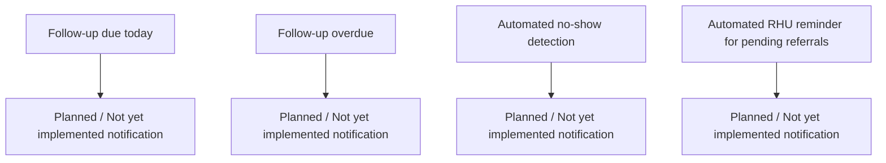
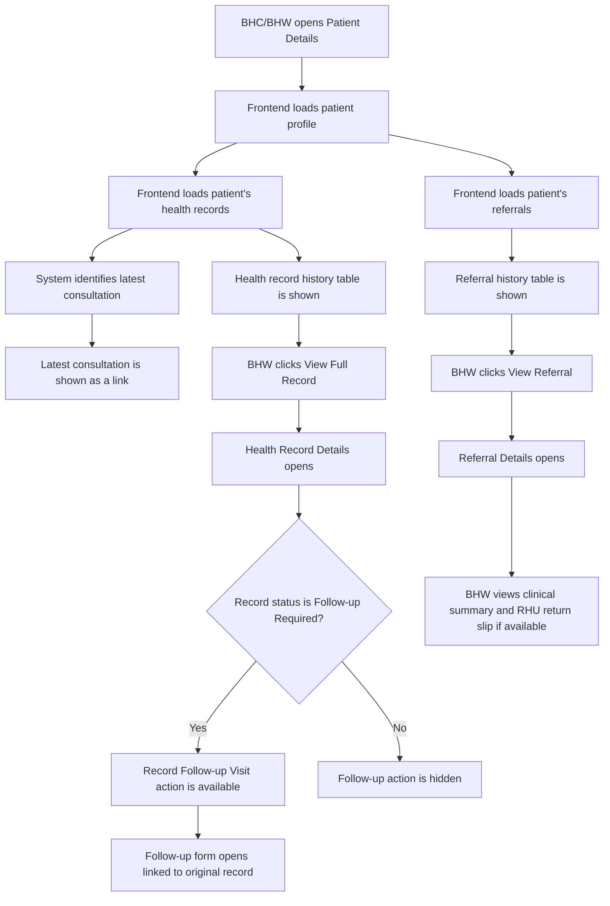

# AKAY System Flowcharts

This document summarizes the main AKAY workflows based on the current frontend and backend code. It is documentation only and does not change application behavior.

## Key Workflow Rules

- Every visit or check-up creates a health record.
- A Follow-up Visit is a new health record linked to the original Follow-up Required record through `parent_health_record_id`.
- Routine Monitoring means the patient is stable but still observed.
- Completed means the health record or referral is closed.
- Referral status is separate from health record status.
- QR code values should contain only a tracking ID or referral token, not full patient data.
- RHU staff can view patient information through an assigned referral context.
- Facility access is enforced in the backend for patients, health records, referrals, incoming referrals, and tracking lookup.
- The code does not store a separate "follow-up fulfilled" flag on the original health record. Fulfillment is inferred in the frontend when a linked follow-up record exists.

## 1. Overall AKAY System Flow

This is the big-picture flow from BHC consultation to RHU referral processing and BHC updates. The implemented backend supports health records, referrals, QR/tracking lookup, referral status updates, feedback/return slip submission, and notifications.

## 2. Add Health Record Flow

The BHC health record form defaults new records to Initial Consultation. The patient status options are Routine Monitoring, Follow-up Required, and Completed. If Follow-up Required is selected, the form shows and requires the follow-up date field.

## 3. Follow-up Visit Flow

A follow-up visit starts from an existing health record marked Follow-up Required. The new follow-up is a separate health record linked to the original record.

Note: The backend does not update the original health record to a fulfilled status. The BHC health records list checks whether a follow-up child exists.

## 4. Referral Creation Flow

Referral creation is separate from saving the health record. The referral is linked to the saved health record when `health_record_id` is sent.

## 5. RHU Incoming Referral Flow

The RHU Incoming Referrals page fetches referrals assigned to the logged-in RHU staff user's facility. The backend scope prevents RHU users from accessing referrals assigned elsewhere.

## 6. QR Scanner Verification Flow

The QR scanner uses the camera through `html5-qrcode`, and it also supports manual entry. The frontend normalizes QR payloads before asking the backend to verify the referral.

Note: The persistent BHC check-in notification is implemented in the backend when RHU updates the referral status to Received. The local RHU facility notification in the QR scanner is frontend cache behavior.

## 7. Notification Flow

Notifications are stored in `user_notifications` and exposed through `/notifications`. Users can list, mark as read, mark all read, and delete notifications.

### Implemented Notifications

### Planned / Not Yet Implemented Notifications

## 8. Patient Details Flow

The BHC Patient Details page shows the patient profile, latest consultation link, health record history, and referral history. Follow-up recording is supported after opening the full health record, not directly from the patient history table.

## Workflows That Are Unclear Or Not Fully Implemented

- Original follow-up fulfillment is not stored as a backend field. The frontend infers fulfillment by checking if a child follow-up record exists.
- Follow-up due today and overdue follow-up notifications are not implemented as persistent backend notifications.
- The QR payload can be a plain tracking ID, `AKAY:REFERRAL:<tracking ID>`, URL, or JSON containing a tracking value. The backend officially verifies `tracking_id` and `qr_code_value`; frontend normalization handles the other input shapes.
- The RHU "patient link" during check-in returns the patient already attached to the referral. It does not create a separate RHU patient record in the current frontend service.
- Some frontend return slip display fields, such as `dateOfReceipt` and `assessmentOutcome`, are richer than the backend feedback payload currently stores. The backend-supported feedback fields are diagnosis, action taken, treatment notes, recommendation, receiving practitioner, remarks, and received timestamp.

